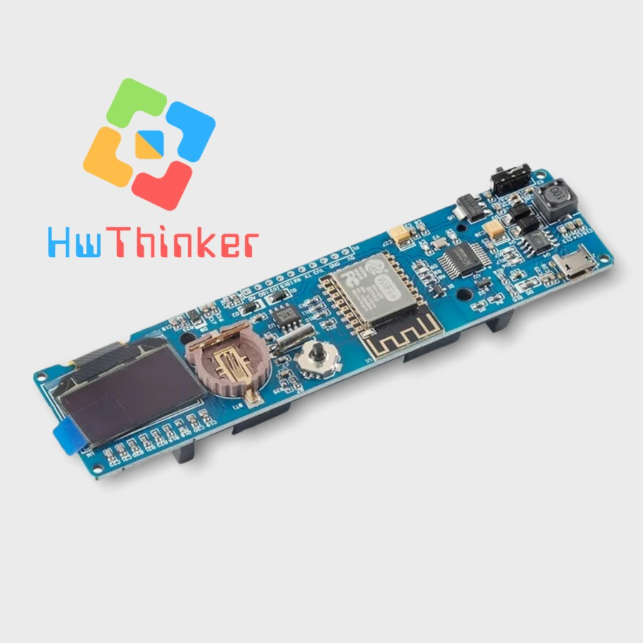
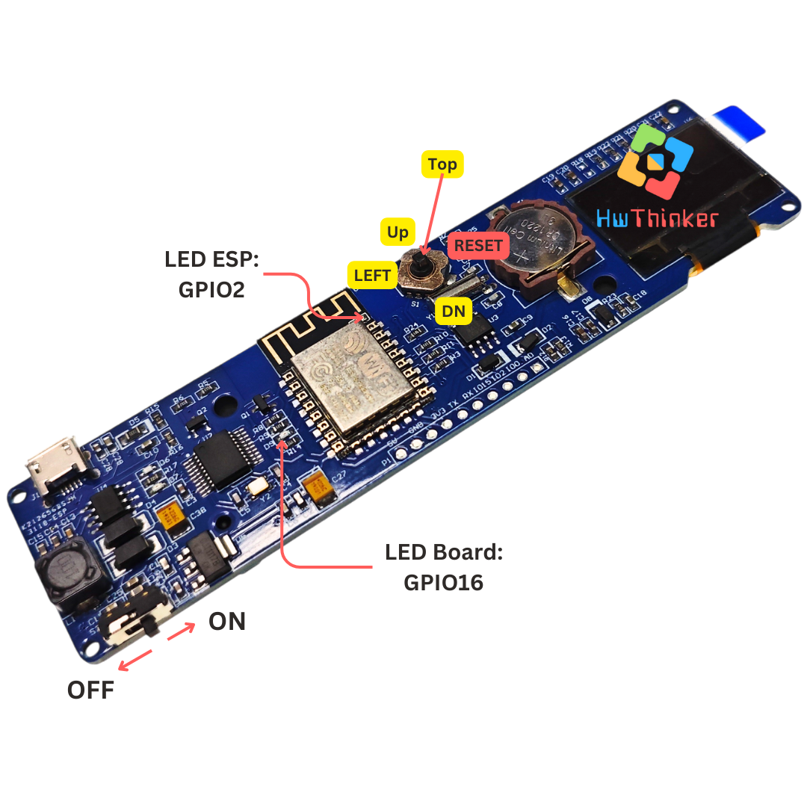
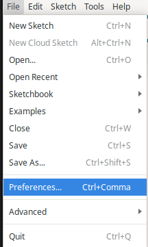
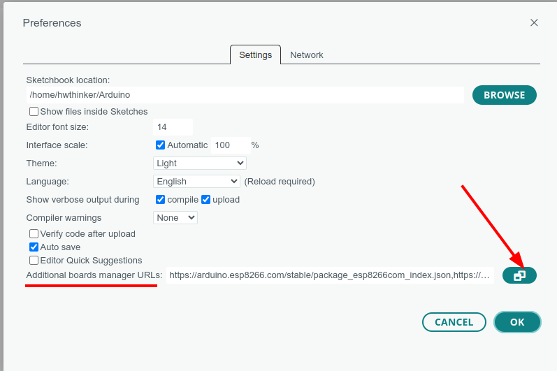
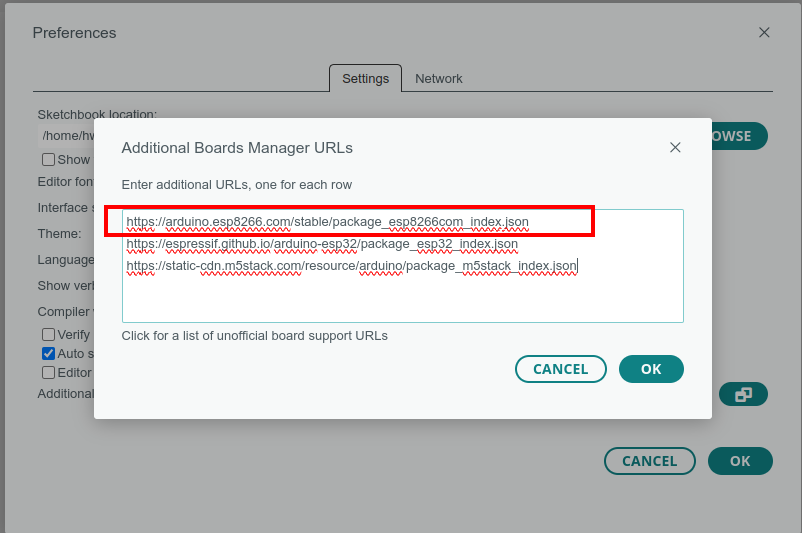
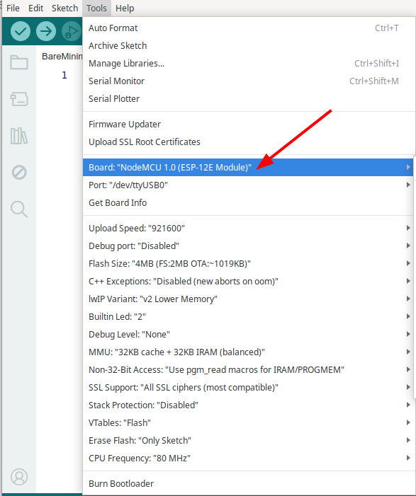
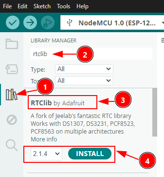
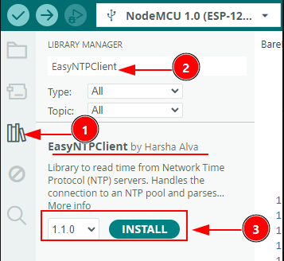

# Modul ESP8266 with RTC OLED



Board ESP8266 (ESP-12F) dengan layar OLED 0,96", RTC PCF8563 (baterai coin cell terpisah), slot 18650, dan joystick 4 arah onboard — cocok untuk proyek jam digital, dashboard mini, atau apa pun yang butuh tampilan dan input fisik tanpa komponen tambahan. Panduan ini mencakup enam contoh program bertahap: LED, OLED, WiFi, RTC, joystick, sampai jam NTP lengkap.



### LED Board
| Perangkat   | GPIO |
|-------------|------|
| LED Board   | 16   | 
| LED ESP     | 2    |

### Joystick
| Tombol               | GPIO |
|----------------------|------|
| Joystick LEFT Button  | 0    |
| Joystick RIGHT Button | x (reset)   |
| Joystick UP Button    | 12   | 
| Joystick DOWN Button  | 13   | 
| Joystick TOP Button   | 14   |

### PCF8563 (RTC)
| Perangkat  | GPIO |
|------------|------|
| PCF8563 SDA| 0    | 
| PCF8563 SCL| 2    |

### OLED Display
| Perangkat | GPIO |
|-----------|------|
| OLED SDA  | 5    | 
| OLED SCL  | 4    |

### ⚠️ Warning
- Lampu indikator akan tetap "ON" walaupun posisi switch OFF. Agar bisa upload Program pastikan switch digeser ke posisi ON  
- Pastikan install driver  Serial USB terlebih dahulu. Driver menggunakan chip ch340
- Hindari Mengeser posisi Joystick ke kanan karena membuat reset 
- Bila karena suatu keadaan program tidak bisa di program, lepasa dan pasang kabel  yang terhubung ke komputer
- bila ada masalah Serial USB di windows11, maka gunakan komputer dengan OS windows 10 kebawah

### Setting Arduino

Masukkan ke File -> Preference




Pada additional Managaer klik edit (kanan bawah)



Masukkan Link berikut https://arduino.esp8266.com/stable/package_esp8266com_index.json pada list board



Setting Board



Source code 

## 1. Blinky LED 

```c++
#include <Arduino.h>
#define LED_Board 16
#define LED_ESP 2
void setup()
{
  pinMode(LED_ESP, OUTPUT);
  pinMode(LED_Board, OUTPUT);
}

void loop()
{
  digitalWrite(LED_ESP, HIGH);
  delay(500);
  digitalWrite(LED_ESP, LOW);
  delay(500);
  digitalWrite(LED_Board, HIGH);
  delay(500);
  digitalWrite(LED_Board, LOW);
  delay(500);
}
```

## 2. Test Oled

```c++
#include <Arduino.h>
#include <Wire.h>
#include <Adafruit_GFX.h>
#include <Adafruit_SSD1306.h>

#define SCREEN_WIDTH 128 // OLED display width, in pixels
#define SCREEN_HEIGHT 64 // OLED display height, in pixels

// Declaration for an SSD1306 display connected to I2C (SDA, SCL pins)
Adafruit_SSD1306 display(SCREEN_WIDTH, SCREEN_HEIGHT, &Wire, -1);

void setup() {
  Serial.begin(115200);
  Wire.begin(5,4);

  if(!display.begin(SSD1306_SWITCHCAPVCC, 0x3C)) { // Address 0x3C for 128x64
    Serial.println(F("SSD1306 allocation failed"));
    for(;;);
  }
  delay(2000);
  display.clearDisplay();

  display.setTextSize(1);
  display.setTextColor(WHITE);
  display.setCursor(0, 10);
  display.println("Halo, world!");
  display.setCursor(0, 20);
  display.println("Today is Friday");
  display.setCursor(0, 30);
  display.println("Happy Weekend");
  display.setCursor(0, 40);
  display.println("Tomorrow is Saturday");
  display.setCursor(0, 50);
  display.println("Peace");
  display.display(); 
}

void loop() {
  
}
```

## 3. Test Wifi

```c++
#include <Arduino.h>
#include <ESP8266WiFi.h>
#include <WiFiClient.h>
#include <ESP8266WebServer.h>
#include <ESP8266mDNS.h>

#ifndef STASSID  
#define STASSID "your-wifi"  // Replace with your WiFi SSID
#define STAPSK "your-password" // Replace with your WiFi password
#endif

const char* ssid = STASSID;
const char* password = STAPSK;

ESP8266WebServer server(80);

const int led = 16;

void handleRoot() {
  digitalWrite(led, 1);
  server.send(200, "text/plain", "hello esp8266 by hwthinker!\r\n");
  digitalWrite(led, 0);
}

void handleNotFound() {
  digitalWrite(led, 1);
  String message = "File Not Found\n\n";
  message += "URI: ";
  message += server.uri();
  message += "\nMethod: ";
  message += (server.method() == HTTP_GET) ? "GET" : "POST";
  message += "\nArguments: ";
  message += server.args();
  message += "\n";
  for (uint8_t i = 0; i < server.args(); i++) { message += " " + server.argName(i) + ": " + server.arg(i) + "\n"; }
  server.send(404, "text/plain", message);
  digitalWrite(led, 0);
}

void setup(void) {
  pinMode(led, OUTPUT);
  digitalWrite(led, 0);
  Serial.begin(115200);
  WiFi.mode(WIFI_STA);
  WiFi.begin(ssid, password);
  Serial.println("");

  // Wait for connection
  while (WiFi.status() != WL_CONNECTED) {
    delay(500);
    Serial.print(".");
  }
  Serial.println("");
  Serial.print("Connected to ");
  Serial.println(ssid);
  Serial.print("IP address: ");
  Serial.println(WiFi.localIP());

  if (MDNS.begin("esp8266")) { Serial.println("MDNS responder started"); }

  server.on("/", handleRoot);

  server.on("/inline", []() {
    server.send(200, "text/plain", "this works as well");
  });

  server.on("/gif", []() {
    static const uint8_t gif[] PROGMEM = {
      0x47, 0x49, 0x46, 0x38, 0x37, 0x61, 0x10, 0x00, 0x10, 0x00, 0x80, 0x01,
      0x00, 0x00, 0x00, 0x00, 0xff, 0xff, 0xff, 0x2c, 0x00, 0x00, 0x00, 0x00,
      0x10, 0x00, 0x10, 0x00, 0x00, 0x02, 0x19, 0x8c, 0x8f, 0xa9, 0xcb, 0x9d,
      0x00, 0x5f, 0x74, 0xb4, 0x56, 0xb0, 0xb0, 0xd2, 0xf2, 0x35, 0x1e, 0x4c,
      0x0c, 0x24, 0x5a, 0xe6, 0x89, 0xa6, 0x4d, 0x01, 0x00, 0x3b
    };
    char gif_colored[sizeof(gif)];
    memcpy_P(gif_colored, gif, sizeof(gif));
    // Set the background to a random set of colors
    gif_colored[16] = millis() % 256;
    gif_colored[17] = millis() % 256;
    gif_colored[18] = millis() % 256;
    server.send(200, "image/gif", gif_colored, sizeof(gif_colored));
  });

  server.onNotFound(handleNotFound);

  server.begin();
  Serial.println("HTTP server started");
}

void loop(void) {
  server.handleClient();
  MDNS.update();
}
```


Untuk Test WIFI pastikan mengubah SSID dan password sesuai dengan acces point di tempat anda pada bagian kode:
```C
const char *ssid     = "your-wifi";  
const char *password = "your-password";  
```
Untuk mengetahui IP pastikan cek Serial segera setelah upload program. Pastikan serial monitor dikonfigurasi dengan baudrate 115200

## 4. Test pcf8563 

## **Langkah-langkah Instalasi Library**

1. **Buka Library Manager:** Klik ikon **buku** di bilah sisi kiri (seperti yang ditunjukkan oleh angka **1** pada gambar). Ini akan membuka panel Library Manager.
2. **Cari Nama Library:** Ketik nama library yang ingin Anda cari pada kolom pencarian (angka **2**). Dalam contoh gambar, library yang dicari adalah `rtclib`.
3. **Pilih Library yang Sesuai:** Hasil pencarian akan muncul di bawahnya. Pastikan Anda memilih library yang dibuat oleh penulis yang benar (angka **3**). Contoh di gambar adalah **RTCLib by Adafruit**, yang sangat populer untuk modul jam (RTC).
4. **Instal Library:**
   - Pilih versi library yang diinginkan (biasanya pilih versi terbaru yang muncul otomatis).
   - Klik tombol **INSTALL** (angka **4**).

------

### **Penting untuk Diperhatikan:**

- **Dependencies:** Jika muncul jendela pop-up yang menanyakan *"Install dependencies?"*, sebaiknya klik **Install All**. Ini memastikan library pendukung lainnya juga ikut terinstal agar library utama berjalan lancar.
- **Status Terinstal:** Setelah selesai, tulisan tombol akan berubah menjadi "INSTALLED".



```c++
// Date and time functions using a PCF8563 RTC connected via I2C and Wire lib
#include <Arduino.h>
#include <SPI.h>
#include "RTClib.h"

RTC_PCF8563 rtc;

char daysOfTheWeek[7][12] = {"Sunday", "Monday", "Tuesday", "Wednesday", "Thursday", "Friday", "Saturday"};

void setup () {
  Serial.begin(115200);
  Wire.begin(0,2);

#ifndef ESP8266
  while (!Serial); // wait for serial port to connect. Needed for native USB
#endif

  if (! rtc.begin(&Wire)) {
    Serial.println("Couldn't find RTC");
    Serial.flush();
    while (1) delay(10);
  }

  if (rtc.lostPower()) {
    Serial.println("RTC is NOT initialized, let's set the time!");
    // When time needs to be set on a new device, or after a power loss, the
    // following line sets the RTC to the date & time this sketch was compiled
    rtc.adjust(DateTime(F(__DATE__), F(__TIME__)));
    // This line sets the RTC with an explicit date & time, for example to set
    // January 21, 2014 at 3am you would call:
    // rtc.adjust(DateTime(2014, 1, 21, 3, 0, 0));
    //
    // Note: allow 2 seconds after inserting battery or applying external power
    // without battery before calling adjust(). This gives the PCF8523's
    // crystal oscillator time to stabilize. If you call adjust() very quickly
    // after the RTC is powered, lostPower() may still return true.
  }

  // When time needs to be re-set on a previously configured device, the
  // following line sets the RTC to the date & time this sketch was compiled
  // rtc.adjust(DateTime(F(__DATE__), F(__TIME__)));
  // This line sets the RTC with an explicit date & time, for example to set
  // January 21, 2014 at 3am you would call:
  // rtc.adjust(DateTime(2014, 1, 21, 3, 0, 0));

  // When the RTC was stopped and stays connected to the battery, it has
  // to be restarted by clearing the STOP bit. Let's do this to ensure
  // the RTC is running.
  rtc.start();
}

void loop () {
    DateTime now = rtc.now();

    Serial.print(now.year(), DEC);
    Serial.print('/');
    Serial.print(now.month(), DEC);
    Serial.print('/');
    Serial.print(now.day(), DEC);
    Serial.print(" (");
    Serial.print(daysOfTheWeek[now.dayOfTheWeek()]);
    Serial.print(") ");
    Serial.print(now.hour(), DEC);
    Serial.print(':');
    Serial.print(now.minute(), DEC);
    Serial.print(':');
    Serial.print(now.second(), DEC);
    Serial.println();

    Serial.print(" since midnight 1/1/1970 = ");
    Serial.print(now.unixtime());
    Serial.print("s = ");
    Serial.print(now.unixtime() / 86400L);
    Serial.println("d");

    // calculate a date which is 7 days, 12 hours and 30 seconds into the future
    DateTime future (now + TimeSpan(7,12,30,6));

    Serial.print(" now + 7d + 12h + 30m + 6s: ");
    Serial.print(future.year(), DEC);
    Serial.print('/');
    Serial.print(future.month(), DEC);
    Serial.print('/');
    Serial.print(future.day(), DEC);
    Serial.print(' ');
    Serial.print(future.hour(), DEC);
    Serial.print(':');
    Serial.print(future.minute(), DEC);
    Serial.print(':');
    Serial.print(future.second(), DEC);
    Serial.println();

    Serial.println();
    delay(8000);
}
```


Untuk test pcf8563 Menggunakan terminal serial dengan baudrate 115200 8bit Noparity 1 stop bit

## 5. Test Joystick 

```c++
#include <Arduino.h>
#include <Wire.h>
#include <Adafruit_GFX.h>
#include <Adafruit_SSD1306.h>

#define SCREEN_WIDTH 128 // OLED display width, in pixels
#define SCREEN_HEIGHT 64 // OLED display height, in pixels

#define LEFT_btn 0
#define RIGHT_btn 1 // WARNING Tidak bisa digunakan karena akan reset
#define UP_btn 12
#define DN_btn 13
#define TOP_btn 14
#define LED_BUILTIN 2

// Declaration for an SSD1306 display connected to I2C (SDA, SCL pins)
Adafruit_SSD1306 display(SCREEN_WIDTH, SCREEN_HEIGHT, &Wire, -1);

bool debounce(int pin)
{
  bool state = digitalRead(pin);
  delay(50);                        // Delay debounce untuk mencegah bouncing
  return state == digitalRead(pin); // Pastikan state stabil
}

void setup()
{
  Serial.begin(115200);
  pinMode(UP_btn, INPUT_PULLUP);
  pinMode(DN_btn, INPUT_PULLUP);
  pinMode(LEFT_btn, INPUT_PULLUP);
  // pinMode(RIGHT_btn, INPUT_PULLUP);
  pinMode(TOP_btn, INPUT_PULLUP);
  pinMode(LED_BUILTIN, OUTPUT);

  Wire.begin(5, 4);

  if (!display.begin(SSD1306_SWITCHCAPVCC, 0x3C))
  { // Address 0x3C for 128x64
    Serial.println(F("SSD1306 allocation failed"));
    for (;;)
      ;
  }
  delay(2000);
  display.clearDisplay();

  display.setTextSize(1);
  display.setTextColor(WHITE);
  display.setCursor(0, 10);
  display.println("Test");
  display.setCursor(0, 20);
  display.println("Joystick");
  display.setCursor(0, 30);
  display.println("move");
  display.setCursor(0, 40);
  display.println("joystick");
  display.setCursor(0, 50);
  display.println("or pressed");
  display.display();
  delay(2000);
  display.clearDisplay();
}

void loop()
{

  if (!digitalRead(UP_btn))
  {
    delay(20);
    if (!digitalRead(UP_btn))
    {
      while (!digitalRead(UP_btn))
        ;
      Serial.println(F("UP_btn"));
      display.clearDisplay();
      display.setCursor(0, 30);
      display.println("UP_btn Press");
      display.display();
    }
  }

  if (!digitalRead(DN_btn))
  {
    delay(20);
    if (!digitalRead(DN_btn))
    {
      while (!digitalRead(DN_btn))
        ;
      Serial.println(F("DN_btn"));
      display.clearDisplay();
      display.setCursor(0, 30);
      display.println("DN_btn Press");
      display.display();
      delay(50);
    }
  }

  if (!digitalRead(LEFT_btn))
  {
    delay(20);
    if (!digitalRead(LEFT_btn))
    {
      while (!digitalRead(LEFT_btn))
        ;
      Serial.println(F("LEFT_btn"));
      display.clearDisplay();
      display.setCursor(0, 30);
      display.println("LEFT_btn Press");
      display.display();
      delay(50);
    }
  }

  if (!digitalRead(TOP_btn))
  {
    delay(20);
    if (!digitalRead(TOP_btn))
    {
      while (!digitalRead(TOP_btn))
        ;
      Serial.println(F("TOP_btn"));
      display.clearDisplay();
      display.setCursor(0, 30);
      display.println("TOP_btn Press");
      display.display();
      delay(50);
    }
  }
}
```


Untuk test Joystick Menggunakan terminal serial dengan baudrate 115200 8bit Noparity 1 stop bit. Bisa juga langsung cek tampilan OLED

## 6. Test Final  

### **Langkah Instalasi EasyNTPClient**



1. **Buka Menu Library:** Klik ikon **tumpukan buku** di sebelah kiri untuk masuk ke menu **Library Manager**.
2. **Cari Library:** Pada kolom pencarian, ketikkan nama library: `EasyNTPClient`.
3. **Verifikasi & Instal:**
   - Pastikan nama library-nya adalah **EasyNTPClient by Harsha Alva**.
   - Klik tombol **INSTALL** pada bagian bawah (nomor **3**) untuk memulai proses pemasangan.


```c++
#include <Wire.h>
#include <Adafruit_GFX.h>
#include <Adafruit_SSD1306.h>
#include <RTClib.h>
#include <ESP8266WiFi.h>
#include <EasyNTPClient.h>
#include <WiFiUdp.h>

#define SCREEN_WIDTH 128 // OLED display width, in pixels
#define SCREEN_HEIGHT 64 // OLED display height, in pixels

// Edit lines 13 and 14 with name and password of specific wireless network
const char *ssid     = "your-wifi";  // Name of the wireless network ESP8266 will connect with
const char *password = "your-password";  // Password for wireless network
DateTime now;   //Variable to hold current time in UNIX seconds
WiFiUDP udp;

// Declaration for an SSD1306 display connected to I2C (SDA, SCL pins)
Adafruit_SSD1306 display(SCREEN_WIDTH, SCREEN_HEIGHT, &Wire, -1);
// Declaration for the RTC IC
RTC_PCF8563 rtc;
// Declaration for NTP Client
EasyNTPClient ntpClient(udp, "pool.ntp.org", -18000); // EST = -18000 seconds; Edit for desired time zone

void setup() {
  Serial.begin(115200);

  // Connect ESP8266 to wireless network of choice
  WiFi.begin(ssid, password);
  while (WiFi.status() != WL_CONNECTED) {
    delay(500);
    Serial.print(".");
  }

  // Begin OLED communication
  Wire.begin(5,4);  // OLED SDA = GPIO5 SCL = GPIO4
  if(!display.begin(SSD1306_SWITCHCAPVCC, 0x3C)) { // Address 0x3C for 128x64
    Serial.println(F("SSD1306 allocation failed"));
    for(;;);
  }
  
  // Get current time from NTP server
  now = ntpClient.getUnixTime() + 1;  // Get current time from ntp server
  Wire.begin(0,2);  // RTC SDA = 0 SCL = 2
  rtc.begin();
  rtc.start();
  rtc.adjust(now);  // load current time into PCF8563 RTC
  WiFi.disconnect(); // Disconnect ESP8266 from wireless network; not needed anymore

}

void loop() {
  Wire.begin(5,4);  //OLED SDA = GPIO5 SCL = GPIO4

  delay(1000); // Effectively update time display every second
  display.clearDisplay();

  // Write out date and time to OLED display
  display.setTextSize(2);
  display.setTextColor(WHITE);
  display.setCursor(10, 0);
  display.print(now.year());
  display.print('/');
  display.print(now.month());
  display.print('/');
  display.println(now.day());
  display.setCursor(14,30);
  display.print(now.hour());
  display.print(':');
  if (now.minute() < 10){  // Add a padding 0 if minutes in single digits
    display.print('0');
    display.print(now.minute());
  }
  else {
    display.print(now.minute());
  }
  display.print(':');
  if (now.second() < 10){  // Add a padding 0 if seconds in single digits
    display.print('0');
    display.println(now.second());
  }
  else {
    display.println(now.second());
  }
  
  display.display();

  Wire.begin(0,2);  // RTC SDA = 0 SCL = 2

  now = rtc.now();  // get latest time from PCF8563 RTC
}
```


Untuk Test Final pastikan mengubah SSID dan password sesuai dengan acces point di tempat anda pada bagian kode:

```C
const char *ssid     = "your-wifi";  
const char *password = "your-password";  
```

## Referensi
- https://www.hackster.io/umpheki/esp8266-clock-module-development-board-d6bcfe
